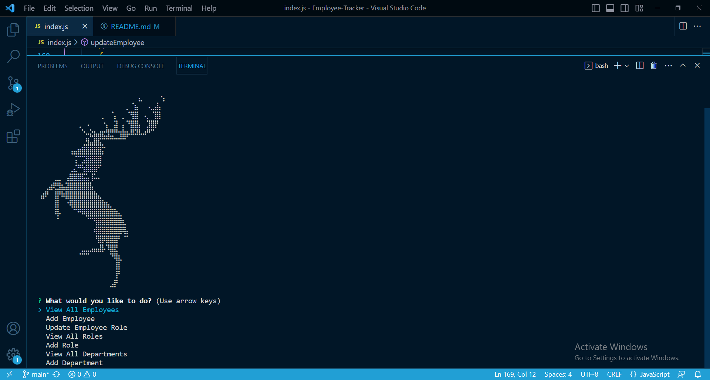

# Employee Tracker MYSQL

## Table Of Contents
- [Description](#description)
- [Use](#use)
- [License](#license)
- [Questions](#questions)
- [Screenshot](#screenshot)
## Description
This application lets you track your employees, departments, and roles in one database

## Use
To use as a tracking tool for lots of different uses

## License
None

## Questions
If you have any questions, you can reach me at https://github.com/safwaan41   
 
or reach out to my email at safwaan41@gmail.com  
  
###  

## Screenshot

[The video walkthrough of the application can be found here](https://drive.google.com/file/d/1Jtcw93Q_8Ft8SqoU538ZCCvwM3k5ciZm/view)

https://drive.google.com/file/d/1Jtcw93Q_8Ft8SqoU538ZCCvwM3k5ciZm/view